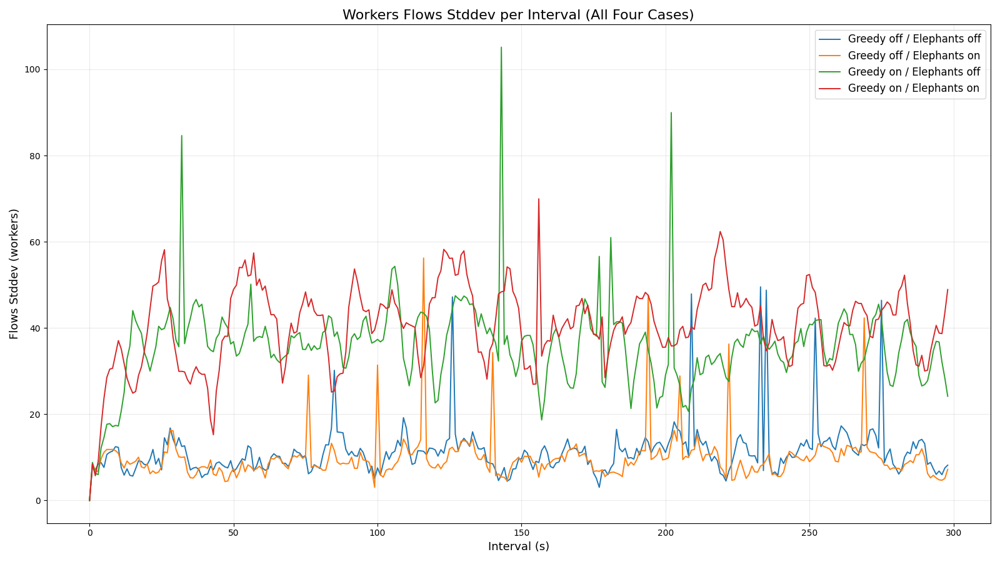
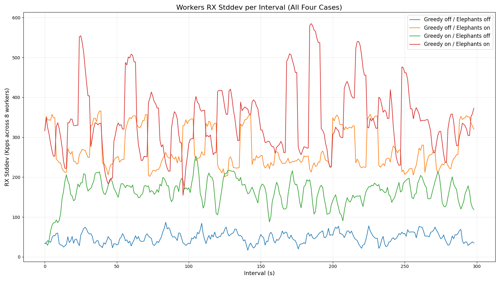
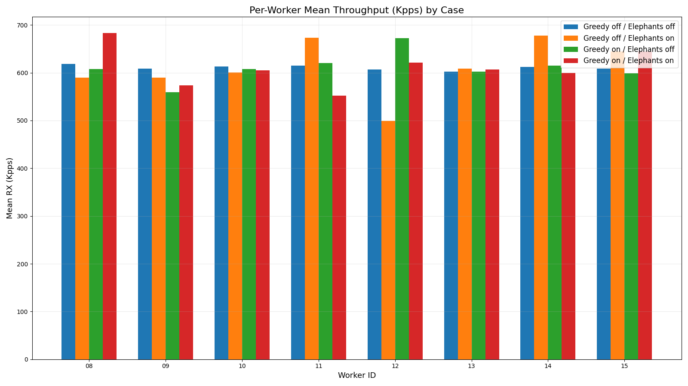

# Software Packet Distributor (SPD) V1.0.5 Performance Analysis

**Author:** Mike Chang  
**Contact:** mikechang.engr@gmail.com  
**Date:** 2026-02-16 09:45 (Taipei, GMT+08:00)  
**Copyright:** © 2026 Mike Chang. All rights reserved.

## Overview

Performance analysis of four test cases (Greedy × Elephants): off/off, off/on, on/off, on/on. Data and plots are computed directly from `putty_LX2160A_0209.log`.

### Environment & Traffic Profile

- **Platform:** NXP **LX2160A‑RDB**, 16× Cortex‑A72 @ 2.2 GHz; LSDK 21.08 (Ubuntu 20.04), Linux 5.10.35; HugeTLB: **1 GiB×4** and **2 MiB×2048** mounted.
- **Cores:** generator on **core 4**; distributors on **cores 6–7**; sink on **3**; perf on **5**; **workers on 8–15** (8 workers).
- **Software:** `software-rss v1.9.7`, ring size **8192**, pipeline **65536**.
- **Flows:** **1024** (mice+elephants; power‑of‑two); **FAT=2048** entries (8‑probe window, 5‑bit modular age); UDP/TCP ~50/50.
- **Elephant profile:** when enabled, **3 elephant flows (~10% each)** via start‑script.

### Methodology

- The log was segmented into four blocks by `[start] ELEPHANTS=…` and `GREEDY=…` markers. All subsequent `[perf]`/`[reta]` lines until the next `[start]` were attributed to that case.
- For each case, we built time series for `workers flows stddev` and `workers rx stddev Kpps` and computed per‑worker **mean Kpps** from `[perf] wXX rx=…` lines.
- Summary statistics include **mean** and **p95** over intervals, plus **Jain’s fairness** and **Max/Min worker mean** computed on the per‑worker means.
- Reporting cadence is ~**1 s** per line; each case spans ~**300 s** (≈300 intervals). The charts plot the *full run* per case.

## Charts

**Flows stddev per interval (all four cases)**

**Workers‑rx stddev per interval (all four cases)**

**Per‑worker mean Kpps (grouped by case)**

## Detailed Statistics

| case                       |   reports |   gen_avg_Mpps |   gen_p99_Mpps |   rx_std_avg_Kpps |   rx_std_p95_Kpps |   flows_std_avg |   flows_std_p95 |   jain_fairness |   max_min_ratio |
|:---------------------------|----------:|---------------:|---------------:|------------------:|------------------:|----------------:|----------------:|----------------:|----------------:|
| Greedy off / Elephants off |       299 |          4.888 |           4.89 |             48.37 |             70.89 |           11.27 |           16.54 |        0.99994  |           1.026 |
| Greedy off / Elephants on  |       299 |          4.888 |           4.89 |            269.99 |            352.56 |            9.8  |           13.84 |        0.992379 |           1.356 |
| Greedy on / Elephants off  |       299 |          4.888 |           4.89 |            163.07 |            209.04 |           35.85 |           46.62 |        0.997733 |           1.202 |
| Greedy on / Elephants on   |       299 |          4.888 |           4.89 |            345.35 |            513.49 |           40.59 |           54.26 |        0.996151 |           1.238 |

### Index Definitions & Interpretation

- **Averages (mean):** The arithmetic mean of a metric over the reporting window (e.g., mean generator rate, mean workers‑rx stddev). Use this to understand the *typical* level of a metric across time.
- **p95 tails:** The 95th percentile across intervals. Shows the upper‑tail behavior (how large the metric gets during the most variable 5% of intervals). p95 is more burst‑sensitive than the mean and highlights spikiness or oscillations.
- **Jain’s fairness index (0–1, ↑ better):** A standard fairness measure over per‑worker *mean* throughputs, \(J = (\sum x_i)^2 / (n\sum x_i^2)\). 1.0 means perfectly even sharing across workers; lower values indicate structural skew.
- **Max/Min worker mean ratio (×):** The ratio of the maximum per‑worker mean Kpps to the minimum per‑worker mean Kpps in a case. Values closer to 1.0× are better (more equal); this complements Jain’s index by exposing the worst‑case spread.
- **Workers‑rx stddev (Kpps):** At each interval, compute stddev across the 8 workers’ `rx Kpps`; then time‑aggregate (mean/p95). Captures short‑term imbalance/oscillation.
- **Flows stddev:** Same idea, but across `flows` per worker. Helps tie load imbalance to unequal flow assignment vs transient rate swings.
